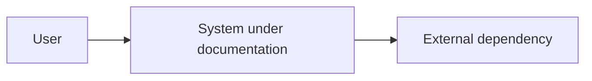
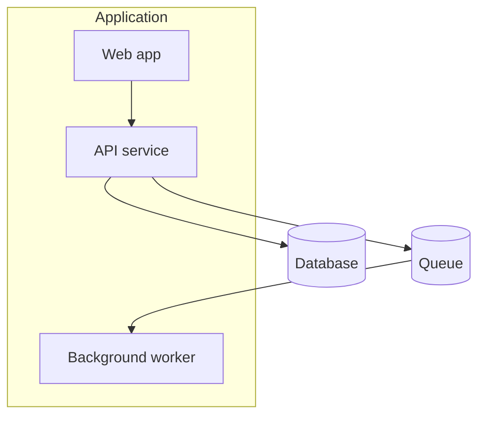
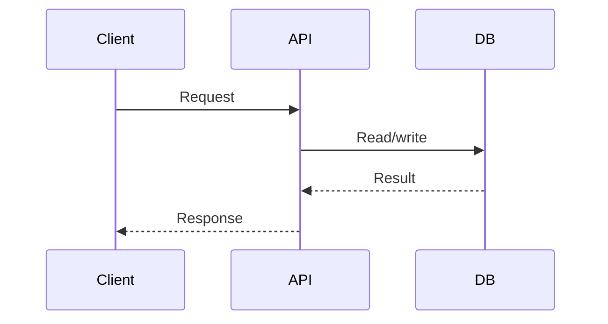

# Diagram Patterns

Prefer Mermaid because it is reviewable, diffable, and supported by GitHub.

## Selection Guide

Use a context diagram when:
- the reader needs to understand users, external systems, and system boundaries
- the repo is one service inside a larger landscape

Use a container diagram when:
- the repo has multiple deployable units, processes, databases, queues, or frontend/backend parts

Use a component diagram when:
- one deployable unit has important internal modules that matter for changes

Use a sequence diagram when:
- one important request, event, or job spans multiple components

Use a data-flow diagram when:
- data ownership, transformation, replication, or privacy boundaries matter

Use a deployment diagram when:
- runtime infrastructure, regions, networking, jobs, or managed services matter

## Mermaid Defaults

### Context

### Container

### Sequence

## Rules

- Keep node names human-readable.
- Keep diagrams under 10 nodes unless the structure is genuinely simple.
- Split diagrams by concern rather than making one large unreadable map.
- Put Mermaid in fenced blocks or `.mmd` files.
- Validate diagrams in CI when the repo already has a Mermaid renderer or markdown linter.
- Do not put secrets, hostnames, customer names, or private environment values in diagrams unless already public and appropriate.
